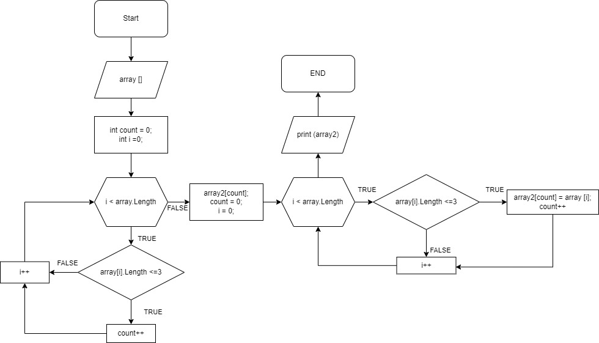

# Описания кода программы.
## 1. Создаем массив строк и выводим его на экран. 
    string [] array = new string [4] {"hello", "2h8", "world", ":)"};
    Console.WriteLine(string.Join(", ", array));

## 2. С помощью метода *NewArraySize* узнаем длину 2-го массива и создаем массив *array2*.

    int NewArraySize (string [] array)
    {

        int count = 0;
        for (int i=0;i < array.Length; i++)
        {
            if (array[i].Length <= 3) count++;
        }
        return count;
    }
    int size = NewArraySize (array);
    string [] array2 = new string [size];

## 3. Для заполнения массива *array2*, необходимо вызвать метод *NewMassive*. 
Метод перебирает массив array и выбранные значения присваивает массиву *array2*.

    void NewMassive (string [] array, string [] array2)
    {
        int count = 0;
        for (int i = 0; i < array.Length; i++)
        {
            if (array[i].Length <= 3)
            {
                array2[count]=array[i];
                count++;
            }
        }
    }
    NewMassive (array, array2);

## 4. Далее необходимо вывести на экран полученный массив *array2*, для этого вызовем метод *PrintArray*.
    void PrintArray(string[] array)
    {
        for (int i = 0; i < array.Length; i++)
        {
            Console.Write($"{array[i]} ");
        }
        Console.WriteLine();
    }
    PrintArray(array2); 

Ниже представлен файл с блок схемой данного задания.

